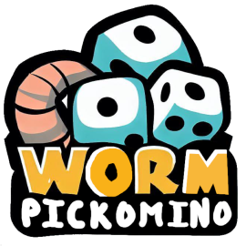



**L’objectif du projet**

Cette SAE, faisant le lien entre trois matières étudiées au cours du semestre, consiste à développer une application en Kotlin/JavaFX. Ce projet permet de mettre en lien les différentes compétences apprises dans les cours de développement orienté objet, d’IHM et de qualité de développement. 

L’application demandée est un jeu de Pickomino, un petit jeu de dés. 

Afin de réaliser le jeu nous avions pour tâches en dev objet, la création de deux diagrammes de classes UML, un premier pour un ensemble de parties et un second, qui sera un raffinement du précédent en précisant nos choix techniques d’implémentation. Nous avons ensuite implémenté en Kotlin notre second diagramme de classe. 

Ensuite concernant le travail à réaliser en IHM, nous avions comme première tâche, la réalisation d’une maquette des différentes vues de notre application. Suite à cela, nous devons implémenter les différentes maquettes des vues. Et enfin développer les différents contrôleurs liés à notre application. 

Enfin, le travail à réaliser en qualité logiciel, était tout d’abord, d’identifier les différents points de vigilance que vous pouvez retrouver dans la partie tests du jeu ci-dessous. Nous avons ensuite conçu et implémenté différents tests fonctionnels pour la librairie pickomino-lib.jar. Et pour finir nous avons rédigé une synthèse présentant les différents tests ayant permis de détecter des bugs.

**Règles du Pickomino**

**I- Contenu du jeu** 

- 8 dés de 6 faces (5 faces représentent les chiffres de 1 à 5, et la 6ème face représente un ver, d’une valeur de 5).
- 16 pickomino contenant une valeur de 21 à 36 et un nombre de vers de 1 à 4

**II- Règles du jeu** 

Les 16 pickominos sont mis devant les joueurs dans l’ordre croissant, le joueur 1 commence avec les 8 dés. 

Le joueur 1 lance ses  8 dés.

A chaque manche il **doit garder les** dés d’une certaine valeur ( 1,2,3,4,5 ou ver ).

Il doit garder tous les dés de cette valeur, par exemple s' il fait 3 deux il devra prendre les 3 deux.

Une fois qu’une valeur a été choisie, les dés de cette valeur sont bloqués jusqu’au choix du pickomino.

Si un joueur joue, il ne pourra pas garder les dés d’une valeur déjà choisie.

Pour récupérer un pickomino il faut que le score cumulé des dés soit supérieur ou égal au nombre affiché sur le pickomino et avoir au moins un ver.

Si nous avons la valeur exacte d’un pickomino situé en haut de la pile d’un autre joueur, nous sommes obligés de voler celui-ci.

Le but du jeu est d’accumuler le plus de pickominos avec le plus grand nombre de vers.

A chaque manche, le joueur relance les dés qu’ils lui restent jusqu’à qu’il puisse se permettre de prendre un pickomino.

Si le joueur n’a pas de ver ou qu’il n’a pas atteint une valeur suffisamment élevée pour jouer, il doit remettre le pickomino au sommet de sa pile dans la brochette des vers et retourner ( rendent inutilisable ) le pickomino ayant la plus grande valeur dans la brochette de vers. C’est le tour du joueur suivant.

Attention, si le pickomino qui a été mis dans la brochette de vers est le plus grand de toute la brochette des vers, on ne retourne pas ce pickomino.

**III- Fin de partie**

Une fin de partie a lieu lorsque tous les pickominos ont été soit pris par les joueurs soit retournés.  Les joueurs comptent le nombre de vers contenus sur l’ensemble de leurs pickominos. Le joueur avec le plus grand nombre de vers gagne. 

**Comment jouer**

**Les tests du jeu**  

Notre application possède de nombreuses fonctions ce qui entraîne forcément de nombreux points de vigilances à tester.  

**Dés :**  

- Tester que les dés retourne des valeurs  entre 1 et 5 ou ver  
- Tester que si l’on choisi une valeur que tous les dés de cette valeurs sont pris (grisé DiceNotInRollException : PickominoException) 
- Tester que si une valeur de dés à été choisi on ne peut plus prendre celle-ci (grisé DiceAlreadyKeptException : PickominoException) 
- Tester que si un dés a été choisi on ne peut pas relancer celui-ci. (grisé) 
- On est obligé de sélectionner un Dé ou un pickomino par tour
- Tester que la valeur d’un ver est de 5 
- Le nombre de dé au départ est égal à 8 

**Pickomino :**  

- Le nombre de pickomino est égal à 16 
- Les valeurs vont de 21 à 36 
- Si pickomino retourné on ne peut plus prendre celui-ci 
- Si la valeur des dés n’est pas suffisante on ne peut pas prendre les dominos (grisé puis blanc) 
- Si le compteur de vers == 0 alors on ne peut pas prendre de pickomino 
- Tester si la valeur des dés est égal au pickomino sur la pile d’un joueur on prend celui-ci 
- Si le joueur ne peut pas prendre de pickomino il remet en jeu le pickomino au sommet de sa pile 
- Tester que si score insuffisant on retourne celui de plus haute valeur mais pas celui qui vient d’être remis 

**Joueur :**  

- Vérifier que la clé correspond à l’identifiant de la partie (IncorrectKeyException : PickominoException) 
- Vérifier que l’identifiant rentré correspond à une partie (UnknownIdException : PickominoException) 
- Le nombre de joueur est entre 2 et 4  
- Username = string len>0  
- Chaque joueur à une pile  
- Chaque joueur a des dés  
- Lorsqu’un joueur joue cela modifie la vue des autres 
- Tester que le score du joueur s'actualise lorsque celui-ci gagne ou perd un pickomino.  

**Fin de partie :**  

- S’il n’y a plus de pickomino en jeu retourne fin de partie et gagnant  
- Le nombre de vers compté est le bon 
- Le gagnant retourné est celui avec le plus de vers 

**Explication des Écrans** 

Le jeu possède *3 Écrans :*

- L'Écran du Menu, permettant de rejoindre ou d’héberger une partie
- L'Écran de Chargement
- L'Écran de Jeu, contenant le plateau de jeu.

**Menu :** 

Le menu sert, soit à rejoindre une partie, soit à en créer une.

Pour ce faire, le menu affiche ces deux choix.

Si l’utilisateur sélectionner “Créer une partie” alors il se voit présenter un textfield, un champ de texte lui demandant le nombre de joueurs pour sa partie

Si l’utilisateur clique sur “Rejoindre une partie”, il devra remplir deux champs de texte, l’un pour se connecter à une autre partie, en demandant “l’identifiant” et le “mot de passe” de la partie.

Et l’autre pour choisir son numéro de joueur.

Aussi, dans tous les cas, le joueur à la possibilité de choisir l’image de son ver.

Attention, si l’utilisateur se trompe de numéro de joueur, la partie est inutilisable !

**L'écran de chargement.**

L’écran de chargement ne servait qu’uniquement à faire patienter le joueur, il ne contenait que peu de chose.

Ce Menu ne contient qu’un texte au centre demandant aux joueurs de patienter, et différentes illustrations de vers autour pour agrémenter.

**Ecran de jeu :** 

La page la plus remplie.

Au **centre**, la totalité des pickominos de la partie sont affichés. 

Au début, ils sont tous retournés face visible.

Sur les côtés, chaque joueur possède sa “zone”.

Il y a 4 joueurs maximum, un bleu, un rouge, un jaune et un vert, représenté par des vers de couleurs correspondantes.

Chaque zone de joueur affiche **les dés conservés** par le joueur, et les dés qu’il joue en temps réel.

Chaque zone de joueur affiche aussi **le dernier pickomino conservé** avec **le nombre de points de vers totaux**.

Élaborer une stratégie de répartition des tâches efficace pour terminer le travail dans les délais impartis

Nous avons commencé à modéliser le système de jeu et les différentes tâches à attribuer.

- Faire un WBS pour la détermination des tâches et faire un gantt

**Projet Pickomino**

Justine BERNIER

Esteban GIROUX

Hippolyte GUILLOTEAU

Clément PASQUET

**But du projet :** 

Réaliser une application permettant de jouer en multijoueur, à un jeu de dés appelé Pickomino.

**Description des vues :** 

Notre jeu comporte trois vues, une pour la vue du chargement de l’ouverture de l’application, une seconde pour le menu principal permettant de paramétrer la partie de pickomino, et une troisième pour l’interface de jeu.

**Méthode de projet :** 

Durant la conception de notre projet, nous n’avons pas utilisé de méthode agile.

Cependant, dans ce rapport, nous verrons comment nous nous serions organisés si nous avions utilisé une méthode agile.

Pourquoi nous avons choisis une méthode agile : 

- Nous sommes un petit groupe, cela nous a donc permis d’être flexible dans l’organisation des réunions que nous pouvions organiser lorsque nous en avions besoin en plus de celle organisée chaque matins.

Ainsi, l’utilisation d’une méthode agile permet d’améliorer la communication entre les membres de notre équipe et d’augmenter notre productivité.

- Nous ne connaissons pas la bibliothèque utilisée.

Ainsi, le fait d’utiliser une méthode agile permet de se coordonner rapidement pour confronter les éventuels problèmes que nous n’avions pas prévus.

**Description de la méthode :** 

La méthode agile est une approche itérative et collaborative qui favorise la flexibilité, la communication et l'adaptabilité dans la gestion de projets, permettant ainsi d'obtenir des résultats rapides et de répondre efficacement aux changements.

**Répartition des responsabilités de chaque personne :**

|Justine|Esteban|Hippolyte|Clément|
| - | - | - | - |
|Implémentation du Menu|Création du système de connexion.|Implémentation de l’interface de jeu|Création du design|

Ici, Justine sera chargée d’implémenter le menu.

Cela sous entend de créer une interface visible par l’utilisateur grâce au design et aux images de Clément.

De même, Justine sera consultée et s'occupera de la création des tests dans le menu avec Clément.

Esteban sera chargé de la conception du système de connexion permettant la liaison avec d’autres joueurs, et de son implémentation, à la fois dans le menu pour permettre de créer ou de rejoindre une partie,  mais aussi dans l’interface du jeu pour pouvoir mettre en place le système de jeu avec Hippolyte. 

Ainsi, il sera consulté dans la conception des tests pour l’interface du jeu, mais aussi pour la création de la structure et de son implantation.

Hippolyte, lui, s’occupera principalement de l’implémentation du design de l’interface de jeu et de ses images qui ont déjà été faits par Clément, que ce soit en créant la structure JavaFX puis en implémentant directement.

Aussi, il sera chargé de créer et d’implémenter les tests de l’interface du jeu.

Clément s’occupera lui de la conception des images, du logo, et aussi de la création des designs, à la fois du menu et de l’interface de jeu.

De même, il est chargé avec Justine, d’implémenter les tests du menu, mais il est aussi consulté pour la création de la structure du menu et de son implantation.

**Comment gérer les risques et les accrocs ?**

L’utilisation d’une méthode agile nous permet de limiter l’impact des éventuelles problèmes  grâce :

- A des réunions quotidiennes appelées “Mêlée”.

Cela permet, tous les matins, d’informer concernant les éventuels “problèmes”, ce qui permet à toute l’équipe de se mettre d’accord sur la façon de le résoudre.

- De changer rapidement les tâches à effectuer.

En se mettant rapidement d’accord sur les problèmes cela permet de s’adapter efficacement aux nouvelles problématiques.

- En faisant tester notre code à différentes personnes.

Cela permet de comprendre facilement l’attente des utilisateurs et d’adapter nos différentes tâches.

**Tableau des backlogs :**

<table><tr><th valign="top">Backlog Complet</th><th valign="top">Backlog du Sprint</th></tr>
<tr><td rowspan="3" valign="top">Créer le Preloader</td><td valign="top">Créer la structure javafx du Preloader</td></tr>
<tr><td valign="top">Mettre ce qui vérifie si l’utilisateur est dans le bon réseau dans le Preloader</td></tr>
<tr><td valign="top">Implémenter le logo dans le Preloader</td></tr>
<tr><td rowspan="7" valign="top">Créer le Menu</td><td valign="top">Créer les images d’interface</td></tr>
<tr><td valign="top">Créer le logo</td></tr>
<tr><td valign="top">Designer le menu</td></tr>
<tr><td valign="top">Créer la structure javafx du menu</td></tr>
<tr><td valign="top">Implémenter le menu</td></tr>
<tr><td valign="top">Implémenter le système de connexion dans le menu</td></tr>
<tr><td valign="top">Création & Implémentation des tests</td></tr>
<tr><td rowspan="7" valign="top">Créer l’interface de jeu</td><td valign="top">Créer les images d’interface</td></tr>
<tr><td valign="top">Designer l’interface de jeu</td></tr>
<tr><td valign="top">Créer la structure javafx de l’interface du jeu</td></tr>
<tr><td valign="top">Implémenter l’interface de jeu</td></tr>
<tr><td valign="top">Implémenter le système de connexion dans l’interface de jeu</td></tr>
<tr><td valign="top">Implémenter le système de jeu dans l’interface de jeu</td></tr>
<tr><td valign="top">Création & Implémentation des tests</td></tr>
</table>

**Diagramme de Gantt :** 

Les différentes sous-tâches représentées dans le tableau des “backlogs” sont représenté dans un “diagramme de Gantt” qui représente les différentes tâches à effectuer au fur et à mesure du temps : 

**Conclusion :** 

Notre projet consiste en une application de jeu de dés multijoueur que nous avions à la base effectué sans méthode particulière, mais nous nous sommes intéressés à comment nous aurions fait le projet si nous avions mis en place une méthode agile, que ce soit à travers la création de sous-tâches via le “Tableau des backlogs” ou via leur répartition en fonction du temps et des personnes.

**Tableau des Responsabilités RAM :** 

R = Celui qui fait le travail

A = Responsable du travail

C = consulté

I = Informé

|N° de tâche|Justine|Esteban|Hippolyte|Clément|
| - | - | - | - | - |
|Modéliser le projet|I|R,A|A|I|
||||||
|Créer les images d’interface du menu dont le logo|C|I|I|R,A|
|Designer le menu|C|I|I|R, A|
|Créer la structure javafx du menu|R, A|I|I|C|
|Implémenter le menu|R,A|I|I|C|
|Implémenter le système de connexion dans le menu|C|R,A|I|I|
|Création & Implémentation des tests du menu|I|R,A|I|R,A|
||||||
|Créer les images d’interface de l’interface|I|I|C|R,A|
|Designer l’interface de jeu|I|I|C|R,A|
|Créer la structure javafx de l’interface du jeu|I|C|R, A|I|
|Implémenter l’interface de jeu|I|C|R,A|I|
|Implémenter le système de connexion dans l’interface de jeu|I|R,A|C|I|
|Implémenter le système de jeu dans l’interface de jeu|I|R,A|R,A|I|
|Création & Implémentation des tests|I|C|R,A|I|
||||||
|Créer la structure javafx du Preloader|R,A|I|I|I|
|Mettre ce qui vérifie si l’utilisateur est dans le bon réseau dans le Preloader|R,A|I|R,A|I|
|Implémenter le logo dans le Preloader|R,A|I|I|C|

